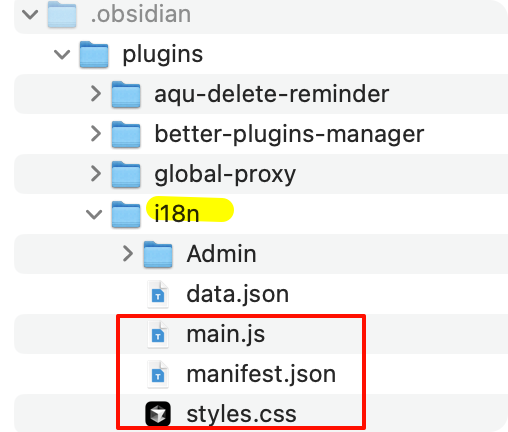
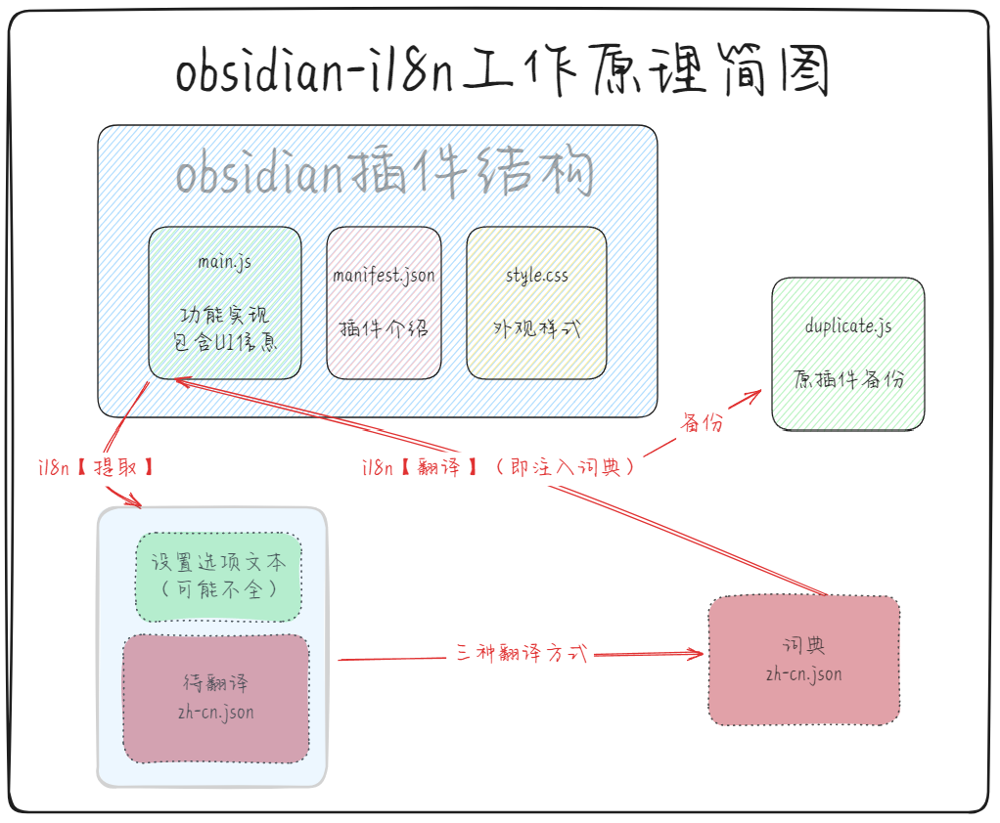

i18n 是一款用于翻译 Obsidian 插件的插件，入门用户可以一键下载其他用户分享的成品词典，进阶用户可以使用内置编辑器翻译插件，支持百度翻译与 ChatGPT ，同时也内置了沉浸式翻译用于应急，最后用户可以选择分享自己的词典，插件内置了贡献用户榜单，截止 2025 年 01 月 10 日，已翻译了[近 300 款插件](https://vika.cn/share/shrULbfcRrjrXZVfMA9P4)。

[项目地址链接](https://github.com/0011000000110010/obsidian-i18n)

#### 手动安装
- 在Github Releases中下载 `main.js`、`manifest.json` 和 `style.css` 三个文件并放入obsidian插件目录下的 `i18n` 文件夹
- 在obsidian设置中确认本插件已启用

> 参考链接：
> 
>https://forum-zh.obsidian.md/t/topic/45242