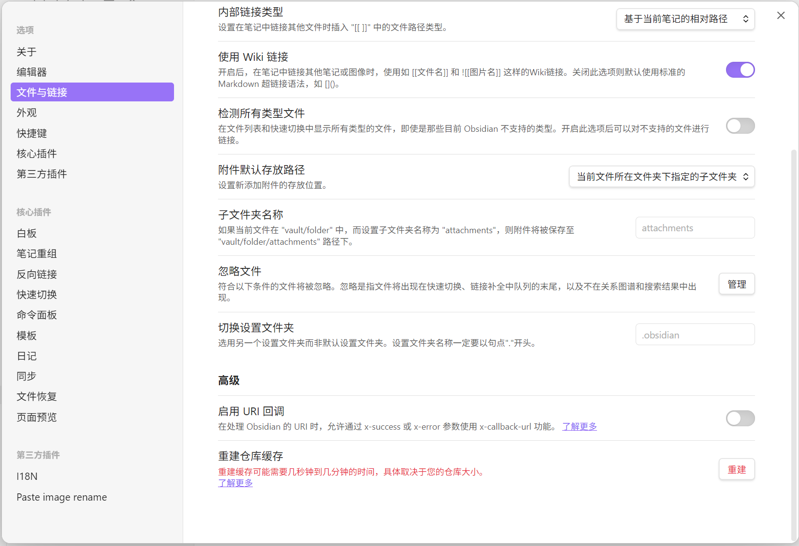
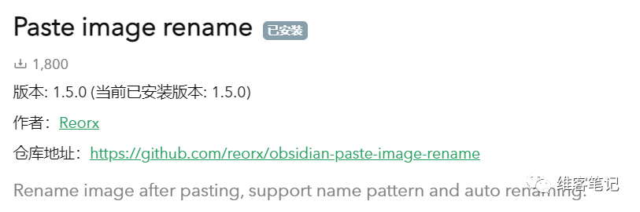

### 01 附件----图片

我会把图片保留在本地，在Ob里是这样设置的

注:这里的文件夹名不能以.开头

这里还要推荐一个给粘贴到Ob里的图片重命名的插件，已上架插件社区，不方便下载的，可以在文末获取（其实我的ob开箱即用库里也包含了此插件[zotero+obsidian+dataview助力文献阅读](http://mp.weixin.qq.com/s?__biz=MzU4MzgxNjczMA==&mid=2247485501&idx=1&sn=5d93a498b1bdfe716b8a7e4b550a973d&chksm=fda20b48cad5825eec357e9ea230d908304dabdcfa19067f912033f0e043cb0bb232cab897e2&scene=21#wechat_redirect)）

这个插件，我用了很久，体验很棒，根据你设置的规则全自动命名，我这里设置的就是以笔记名+数字作为图片名称，方便日后检索~-

{{fileName}}-{{DATE:YYYY-MM-DD-HH-mm-ss}}

#### 清除Obsidian没有被引用的附件

[clear unused images](https://github.com/ozntel/oz-clear-unused-images-obsidian)

> 参考链接：
> 
>https://forum-zh.obsidian.md/t/topic/8497/2