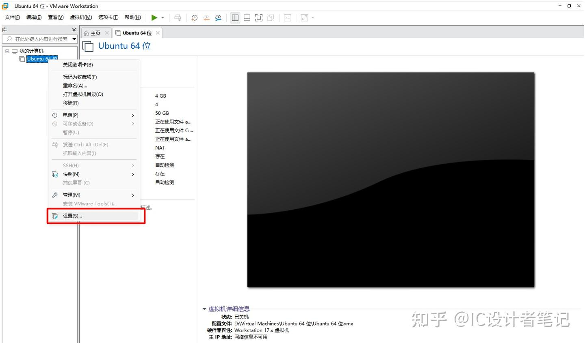
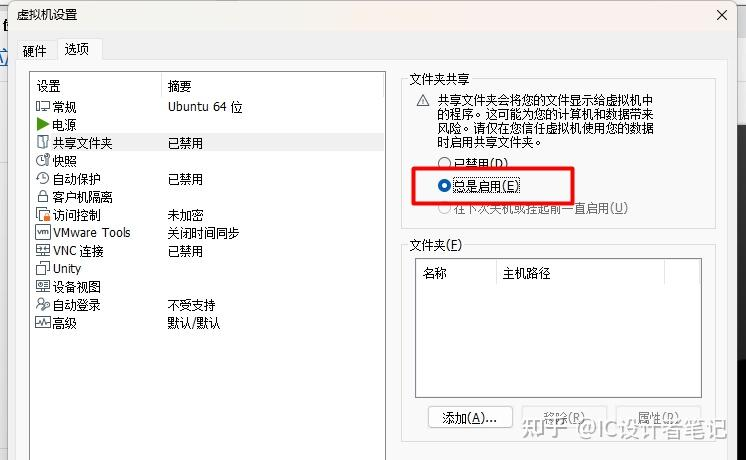
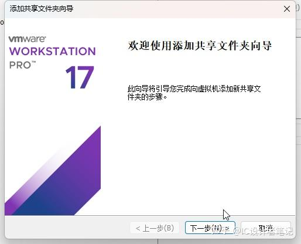
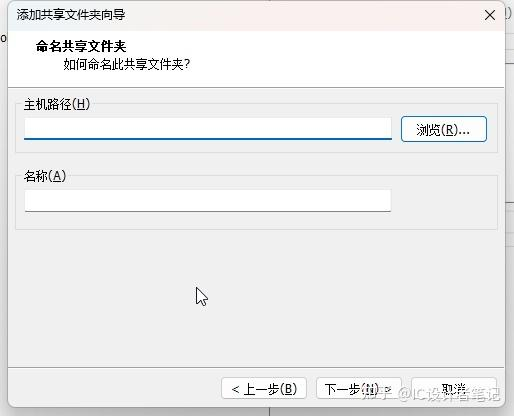
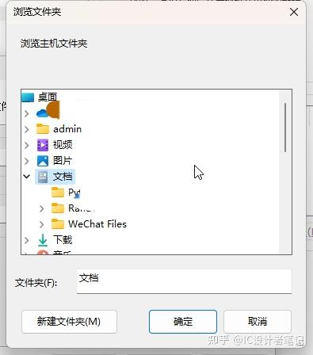
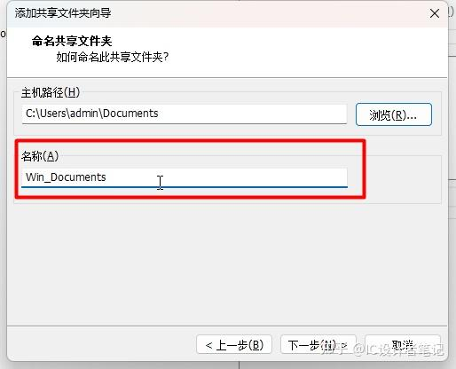
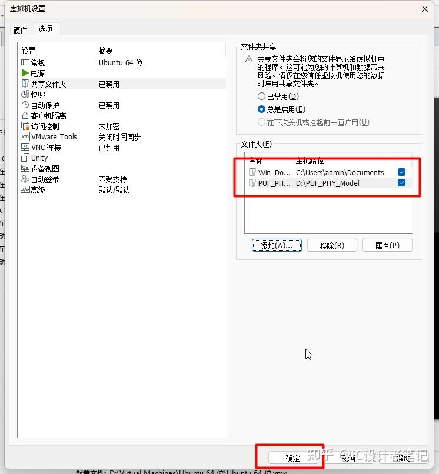

打开 “设置 -> 选项 -> 共享文件夹”



选择“总是启用”



点击“添加”，进入共享文件夹向导。点击“下一步”



点击“浏览”



选择需要共享的文件夹，点击确定



“名称”即虚拟机中显示的名称，点击“下一步”->“完成”



用此方法添加全部需要共享的文件夹，添加完成后如下图所示，点击“确定”



终端运行

```text
sudo apt install open-vm-tools-desktop

sudo mkdir /media/vmware

sudo mount -t fuse.vmhgfs-fuse .host:/ /media/vmware -o allow_other
```

```text
su

echo '.host:/ /media/vmware fuse.vmhgfs-fuse allow_other,defaults 0 0' >> /etc/fstab
```

重启


> 参考链接：
> 
>https://zhuanlan.zhihu.com/p/650638983