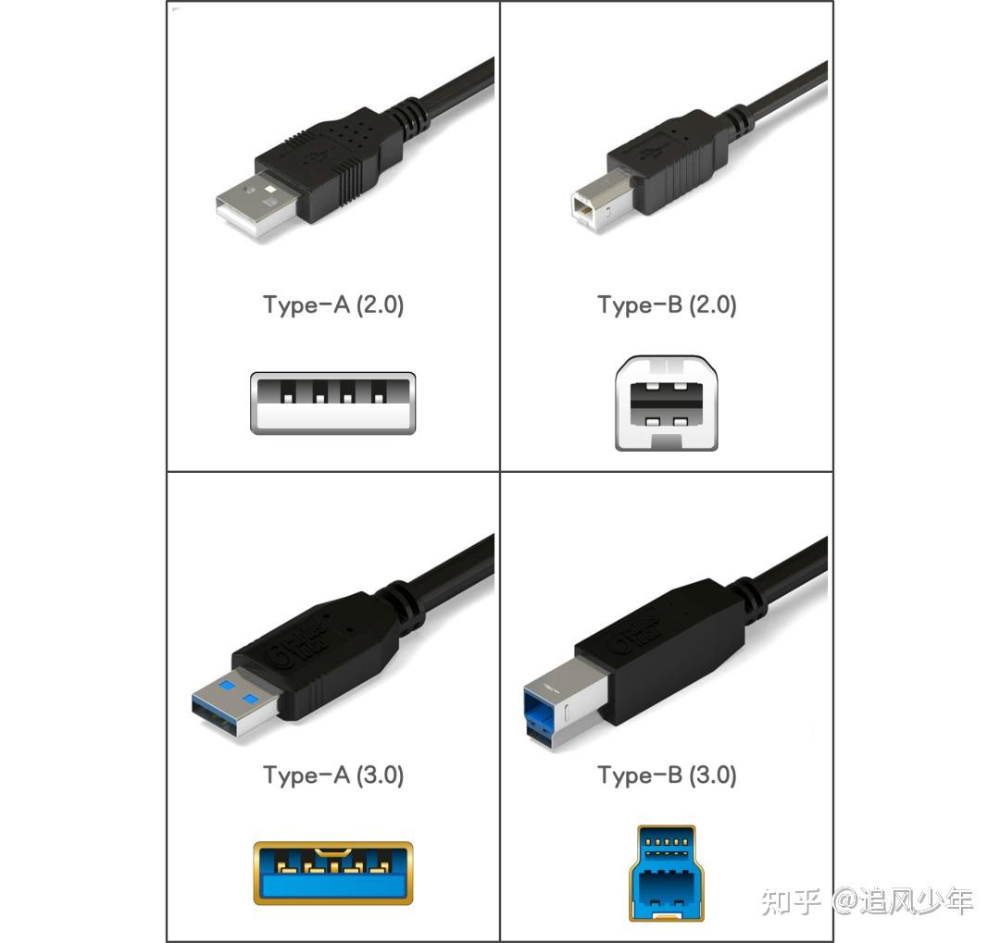
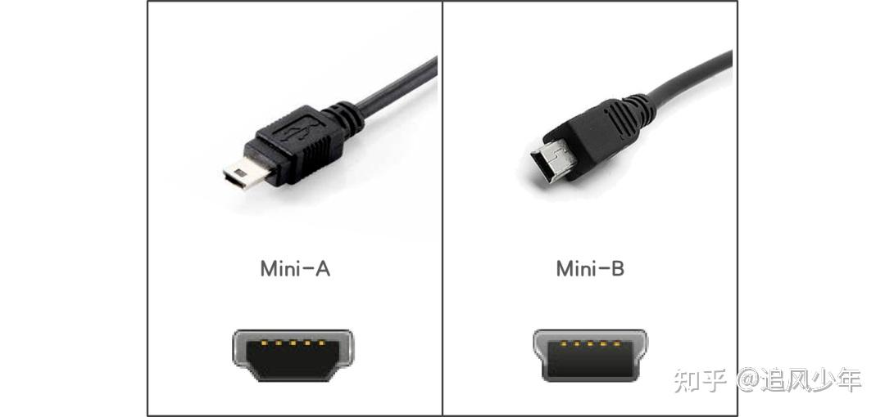
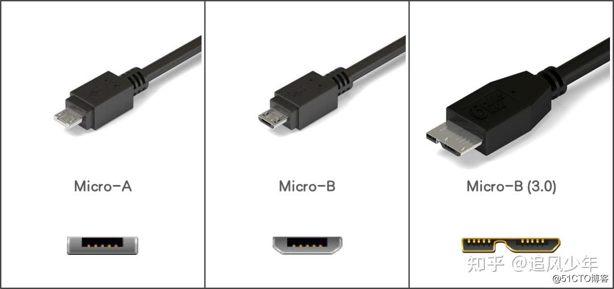
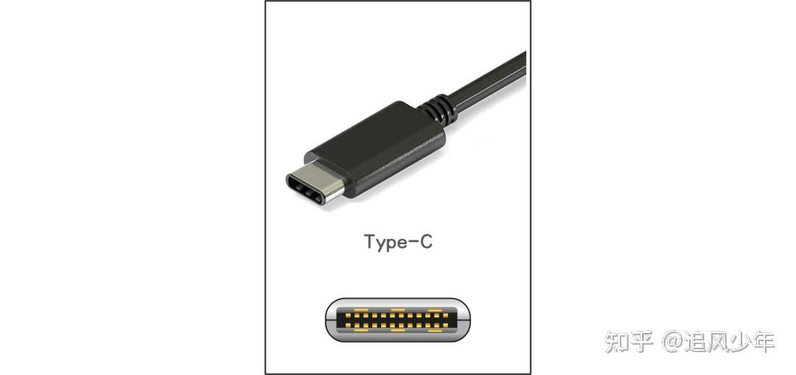

## 一、USB传输标准

### USB 1.0 and USB 1.1

1995 年，成立了 USB-IF，该组织于次年宣布推出 USB 1.0。USB 1.0 规定的数据速率为 1.5 Mbit/s（低带宽或低速），最大输出电流为 5V/500mA。但不幸的是，这个 USB 版本也很少被制造商采用。

1998 年，USB-IF 发布了 USB 1.1，将传输速率提高到 12 Mbit/s（全速），并修改了 USB 1.0 中的一些技术细节。从这个版本开始，制造商开始尝试在他们的产品上使用 USB 标准。

说明：

USB 1.0 现已更名为 USB 2.0 LowSpeed，USB 1.1 已更名为 USB 2.0 FullSpeed。因此，他们的速度也是 USB 2 速度。

### USB 2.0

2000 年，USB 2.0（后来更名为 USB 2.0 HiSpeed）标准正式登台，并在随后的几年中迅速流行起来，并宣布许多老一代接口标准的终结。USB2.0 自推出以来仍在使用，可以说是寿命最长的 USB 标准。

USB 2.0 速度为 480Mbps （60MB/s），最大输出电流为 5V/500mA

### USB 3.0

USB 3.0，也称为 USB 3.1 Gen1/USB 3.2 Gen1，于 2008 年发布。它采用了 9 个引脚的设计，其中第一排 4 个引脚与 USB 2.0 相同，第二排 5 个引脚专为 USB 3.0 准备。因此，您可以通过引脚来区分 USB 2.0 和 USB 3.0（USB 2.0 只有 4 个引脚）。

有两种 USB 3.0 速度。原始 USB 3.0 速度达到 5.0Gbps （640MB/s），最大输出电流为 5V/900mA。但是，USB 3.0 具有双通道模式（USB 3.1 Gen1x2），可以使速度达到 10Gbps（每通道 5Gbps）。限制是双通道模式需要使用 USB Type-C 接口。

USB 3.0 速度不仅使数据传输更省时，而且足以让桌面操作系统在 USB 闪存驱动器和便携式硬盘驱动器上安装和流畅运行。

最后，USB 3.0 向后兼容 2.0，并支持全双工数据传输（即可以同时接收和发送数据;USB 1x 和 USB 2.0 是半双工的）。

### USB 3.1 and USB 3.2

USB 3.1，也称为 USB 3.1 Gen2/USB 3.2 Gen2x1，于 2013 年发布。USB 3.1 速度达到 10Gbps （1280MB/s），最大输出电流增加到 20V/5A （100W）。此 USB 协议向后兼容 USB 3.0/2.0/1.0。

USB 3.2，也称为 USB 3.2 Gen2x2，于 2017 年发布。它可以看作是具有双通道模式的 USB 3.1。USB 3.2 使用 USB Type-C 接口启用双通道模式，每个通道的传输速度为 10Gbps。因此，USB 3.2 的理论速度为 20Gbps。

### USB4接口

USB4 于 2019 年发布。它集成了 Thunderbolt 3 协议，并向后兼容 USB 3.2 和 USB 2.0。USB4 使用 USB Type-C 接口，在双通道模式下可以达到 40 Gbps 的速度。

|**Standard**|**Also Known As**|**Year Introduced**|**Connector Types**|**Max. Data Transfer Speed**|**Cable Max Length**|
|---|---|---|---|---|---|
|USB 1.1|Full Speed USB|1998|USB A USB B|12 Mbps|300cm|
|USB 2.0|Hi-Speed USB|2000|USB A USB B USB Micro A USB Micro B USB Mini A USB Mini B USB C|480 Mbps|500cm|
|USB 3.0|USB 3.1 Gen 1 USB 3.2 Gen 1 SuperSpeed|2008|USB A USB B USB Micro B USB C|5 Gbps|300cm|
|USB 3.1|USB 3.1 Gen 2 USB 3.2 Gen 2 SuperSpeed+ SuperSpeed 10Gbps|2013|USB A USB B USB Micro B USB C|10 Gbps|300cm|
|USB 3.2|USB 3.2 Gen 2×2 SuperSpeed 20Gbps|2017|USB C|20 Gbps|300cm|
|USB4 20Gbps|USB4 Gen 2×2|2019|USB C|20 Gbps|80cm|
|USB4 40Gbps|USB4 Gen 3×2|2019|USB C|40 Gbps|80cm|

## 二、USB接口类型

### 1、标准USB接口

又分为Type-A和Type-B两种，样貌如下：

其中Type-A和Type-B根据支持的USB标准不同，又可以分为USB 2.0和USB 3.0标准USB接口。根据接口的颜色，我们很容易区分该接口是支持USB 2.0还是支持USB 3.0的。Type-A型接口也是我们日常生活中最常见的USB接口，广泛应用于鼠标、键盘、U盘等设备上，Type-B型则常用于打印机、特殊显示器等设备上。

### 2、Mini USB接口

Mini USB接口，是一种小型的USB接口，其指标与标准USB相同，但是加入了ID针脚（用于区分设备是主机还是外设），以支持OTG（On The Go，该功能允许在没有主机的情况下，实现设备间的数据传送）功能。Mini USB接口主要分为Mini-A和Mini-B两种，样貌如下：

Mini USB接口由于相对较小的体型，常见于一些小型设备上，比如MP3、MP4、收音机等，某些型号的手机也采用了该接口。

### 3、Micro USB接口

Micro USB接口，属于Mini USB的下一代规格接口，Micro USB接口的插头采用了不锈钢材料，插拔寿命提高为10000次，相比Mini USB接口，在宽度几乎不变的情况下，高度减半，更为小巧。Micro USB接口也可分为Micro-A和Micro-B两种，样貌如下：

Micro-B类型的USB接口，相信大家都认识，只是不知道它的专业名称，在智能手机发展的前期，绝大多数的智能手机（苹果手机除外）都采用了Micro-B型接口作为充电和数据接口。**在USB 3.0标准发布后，Micro-B接口也有了新的造型**，相信大家也不陌生，我们购买的支持USB 3.0的移动硬盘盒大部分就采用了该接口。

### 4、Type-C接口

Type-C接口，是近几年出现的新型USB接口，该接口对于使用者来说，相信最大的好处就是可以正反插拔了吧。

据统计，平均每人每年在插USB上浪费的时间是30分钟！第一次插总是插不进去的，多次插拔到怀疑人生时，最后发现还是第一次的才是对的，后面的N次尝试不过是人生中的小小曲折，有了type-C接口后终于可以一次搞定了。Type-C接口的样貌如下：

最新的USB4标准目前仅支持Type-C接口，同时USB4采用了Thunderbolt协议（俗称雷电接口协议，是由Intel主导开发的接口协议，具有速度快，供电强，可同时兼容雷电、USB、Display Port、PCIe等多种接口/协议的特点），因此，支持USB4标准的Type-C接口也是可以兼容雷电接口的。如此看来，Type-C接口已是大势所趋了。

> 参考链接：
> 
>https://www.bytecable.com/usb-speed-comparison/
> 
>https://zhuanlan.zhihu.com/p/447595295