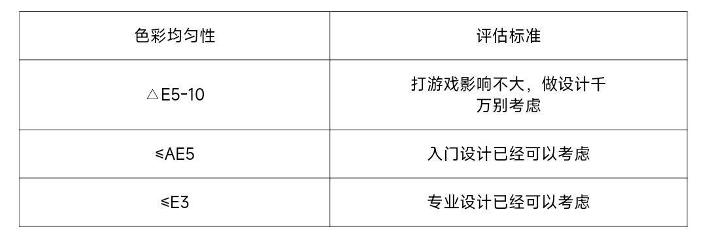
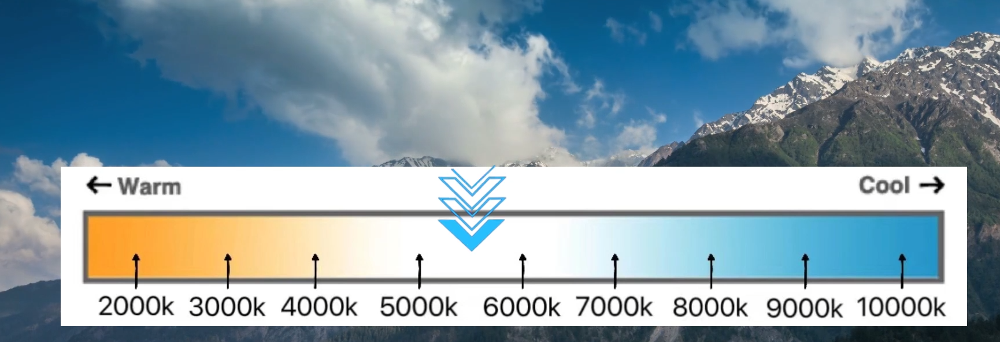

🔸分辨率

开头先讲大家最关心的，也是想的重要的分辨率，分辨率其实就是清晰度，相同分辨率下尺寸越小越清晰，反之越大则越不清晰，说白了图像的显示都是由许多像素点组成的。分辨率就代表了像素个数，分辨率128*100就代表水平方向含有像素点128个，垂直方向含有像素点100个。

当图像尺寸一样的情况下，分辨率越高，说明像素点越多，显示效果就越精细和细腻

25*19

我的世界（不是）

50*37

500*378

分辨率当然越高越好，当然也要看你的显卡能否带动（显卡谢谢你）  
  
🔸尺寸  
尺寸我这里就不多说了，尺寸越大，看到的东西也就越多

在分辨率不提升的情况下尺寸越大画面也会相对更加模糊，结合上面提到的分辨率，因为你的显示器像素点是不变的，面积越大，像素点密集度也就越低，这里我们经常说到的ppi指的就是像素密度

我这里推荐，如果你是重度FPS玩家，我这里更推荐小屏幕，很多只有选手也是用的小屏幕，小屏幕的优点是让你注意力更加集中，相反你个你平常是工作需要或者玩ARPG和moba，当然越大越好，1080p 24和27都不错，2k的话27，32以上就推荐4k了，不然屏幕就回很糊
  
🔸刷新率  
刷新率以Hz为单位，指电子束对屏幕上的图像重复扫描的次数。通俗的讲就是屏幕每秒被画面被刷新了多少次。刷新率越高，每秒刷新的画面数越多，图像越稳定清晰。反之，刷新率低，图像就容易看到闪烁和抖动。

我通俗一点讲就是，显卡在你的电脑上画图，刷新率表示就是他在一秒钟之内画了多少张画面刷新率越高越好，当然人眼感受刷新率存在边界效应，一般100-200左右已经能满足大部分人的需求，60-75一般是对作图办公这种不需要高刷新率的人群使用的，在200以上就是FPS重度玩家和职业选手的地区了
  
🔸垂直同步  
为什么我这里突然就开始说垂直同步了，先问大家一个问题，你玩游戏的时候帧率是一直稳定在一个地方不动的么，显然不是，通俗点来说比如你的显示器是144hz的，显示器一秒钟可以输出144张图片，但是如果你正在玩荒野大镖客2，然而你的显卡是1060这样的显卡，显然你的显卡不能一秒钟画出144张图画出来，于是这种画面诞生了

当然实际游戏肯定没有这么明显，同样如果你在玩csgo，如果你的显卡足够强劲，一秒钟能画200+张图画，但是你的显示器是60hz的，这个时候就会出现丢帧，部分画面就直接丢弃了，那垂直同步有什么用呢，如果你显卡画图速度跟不上显示器，那么显示器就会等显卡画好再显示，反之如果你显卡一秒钟能画144张图片你开启垂直同步，显卡只渲染60hz画面（偷懒是吧），画面就出出现延迟如果你玩别的游戏还好，但对于pfs玩家这就相当致命了

所以我们老黄和就推出了他个割韭菜方案，G-SYNC，具体原理我篇幅限制我就不多说了，反正就是为了解决pfs重度玩家的丢帧和延迟的通点问题

当然苏妈也有，不过因为是完全免费，效果就回查一点，老黄家的价格都不会便宜，当然普通玩家根据自己的需要选着对于刷新率的显示器就行，比如你主玩csgo，显卡是3060，帧率差不多在200左右，买一个144hz的刷新率显示器，锁定帧率在250左右，也能得到很不错的游戏体验了  
  
🔸响应时间  
可以看到现在很多厂商宣传的都是什么1毫秒，5毫秒的响应时间，不过测试方式懂得都懂，现在这个参数不具备选购价值看个乐就行

•面板

适应性最广，属于是万金油，买这个肯定不会坏到哪里去，后面厂商还推出了Fast IPS、Nano IPS，加快了反应时间和对比度

色彩度最好，因为容易弯折，在很多大屏幕的带鱼屏上用的较多

点名卓伟，属于是极致FPS玩家的选择  
  
还有OLED和miniLED和具体那个面板好，篇幅限制我这里就不单独展开说了，感兴趣可以评论区留言，人多我就专门出一期  
  
🔸色域  
说这个之前，大家一个都记得初中上的物理课的三棱镜实验，知道光是有多个颜色构成的

但是一个颜色和别的颜色搭配或者深浅度的不用，一个颜色又会衍生出很多别的颜色

比如这个红色，而且显示器的显示要怎么知道你到底要什么样的红色呢，这个时候色域图就出来了

1931年，国际照明委员会发布了CIE1931色彩空间，图中彩色的部分就是人眼能看见的颜色  
这其中因为各个行业的要求和标准又制定不用的色彩范围

sRGB是由微软和惠普为数字用途开发的RGB色彩空间。它是最适合计算机屏幕和其他数字设备的色彩空间，因为微软的主要倡议，使得 sRGB 成为默认颜色空间（任何具有类似计算机功能的设备都使用 sRGB），但是，它仅覆盖CIE XYZ色彩空间的约30%。

我们的winds也只认srgb，而且默认渲染为100srgb，还不能调，而现在现在很多手机的分辨率和刷新率都比显示器还高，而且还能调，iPhone的原彩就是根据环境光调整显示

我只能说微软真有你的
  
Adobe RGB  
为了更好地表示CMYK打印机上可实现的所有颜色Adobe公司开发Adobe RGB，这意味着它可以显示更大范围的颜色（约50%CIE XYZ），最明显的优势是青绿色调。  
  
NTSC  
NTSC色域是NTSC电视标准下的色彩空间，NTSC是美国国家电视标准委员会，他们所推出的NTSC电视标准是一套电视传输协议，被运用在美国，日本等国家的广播电视系统中。当然这也就意味着，NTSC色彩空间更多的被运用在电视行业。  
  
P3  
在广义上来讲，P3 色域包含了DCI-P3 和 Display P3。  
  
DCI-P3是一种应用于数字影院的比较新的色彩标准，以人类视觉体验为主，尽可能匹配电影中能展现的全部色彩要求，换句话来说可以称之为电影级色域标准。相对于sRGB而言，DCI-P3覆盖了更多的红色和绿色，因此DCI-P3显示器对绿色和红色的还原能力更强，而且更加锐利，能更好地展现了人眼能看到的真实色彩。在HDR效果方面，能包容的亮度范围越大，亮度的层次也会越多，同样的色彩、灰度这些信息也会更加丰富，更大的色域，在HDR技术下能表现更多的色彩  
————————————————————  
普通用户和设计从业者选择srgb即可，印刷制图选择Adobe即可，因为看电影就不用我说了
  
•色域容积和色域覆盖  
”色域覆盖“与”色域容积“是完全是两个不一样的概念，以摄影专显SW240为例，100%sRGB指的是“色域覆盖”，就是能显示出sRGB色彩空间中所有颜色。图形说明会更好理解：在下图中可以看到，左边三角形 A 代表 sRGB标准色域，而三角形B代表摄影专显SW240色域，两者面积一样大。色域覆盖最高只能达100%

右图三角形是讲“色域容积”，依然A 代表 sRGB标准色域，三角形B代表100% sRGB 色域容积，可以明显看出，有覆盖不到的地方。  
  
色域容积指的是显示器能显示的所有颜色与目标色彩空间比值，即显示器色域和sRGB色域体积的绝对比值。比如我们会见到130%sRGB,表示它的色域（体积的投影）面积是sRGB1.3倍。130%sRGB不仅仅无法覆盖整个sRGB色域，还会因为色彩溢出造成了颜色偏差和过饱和问题。  
————————————————————  
这些厂商真的有够恶心的
  
🔸色准  
色准顾名思义就是说，显示出的颜色准不准，或者说，你显示器的颜色和“标准的”、“正确的”颜色相差了多少。色准我们通常用△E值来表示，那问题来了要是不准怎么办呢

一般好一点的显示器会有出厂校色（价格不菲），通过icc文件储存在显示器的固件里，当然你自己也可以校色
  
一般来讲，△E≤1.5就是色准极好，可以定位为S级，物理意义上几乎不存在色偏。  
△E值在1.5-3之间可以说是非常优秀，定位为A级，这种屏幕专业人士用肉眼也很难看出色偏，大部分高端绘图显示器基本都可以做到，当然价格也会偏高。  
△E值在3-5之间可以评价为优秀，定位B级，日常使用几乎不会有影响，大部分高端显示器以及高刷的显示器都可以达到。  
△E值在5-8之间就是普通的显示器了，只能定位C级，色彩敏感的比如经常修图的人通常可以看出有偏色情况，通常这样的显示器也比较平价。  
△E值在8以上就是很差的色准水平了，大部分人都能看出有色差，不建议从事专业领域人士使用  
  
🔸色深  
色深即色彩深度，色彩深度是计算机图形学领域表示在位图或者视频帧缓冲区中储存1像素的颜色所用的位数，它也称为位/像素（bpp）。色彩深度越高，可用的颜色就越多。  
————维基百科

通俗一点看图就明白了，市场是还有很多什么6抖8，8抖10的显示器，那这些又是什么情况呢?所谓“6抖8”，就是通过软件插值的方式来强行丰富灰阶级数。在显示效果上比不带抖动的6bit屏稍微改善一点，但和原生8bit相去甚远。这种抖动技术，正规名称为FRC技术，一些显示器购买页的详细信息里会说明这点（当然有的就不写出来）

其实就和OLED的频闪差不多得意思，就是通过反复横跳实现假8bit或者屏幕常亮的技术，如果大家选购显示器的话，建议选择原生8bit的屏幕，对于一些专业设计人士来说，10bit屏当然是更好了，不过市面上的原生10bit屏售价都比较高昂  
  
•HDR  
HDR(High-Dynamic Range)简单来说就是一种提高影像亮度和对比度的处理技术，它可以将每个暗部的细节变亮，暗的地方更暗，丰富更多细节色彩，让电影，图片都能呈现出极佳的效果。让你在观影时更接近真实环境中的视觉感受，这就是HDR存在的意义。传统SDR（标准对比度）最高亮度只有100nit,画面中高于100nit的部分将被失真（丢失），最低调试为0.1nit,画面中低于0.1nit的部分将被丢失。HDR技术的出现，让最高亮度达到数千nit,，最低亮度达到了0.0005nit,极大的拓展了画面中亮度高于100nit以及低于0.1nit部分的细节，同时让整幅画面看上去更加通透明快、细节丰富。反正就是看电影非常好

如果你要买建议600的起步，400和500标准太低，大部分显示器能用胜任  
  
总于写完了，如果不想看，现在懒得看的，可以直接移步我的显示器推荐

⚪亮度  
这个不起眼的参数我发现大家好像忽视了这一点，或者说大家不知道厂商宣传的nit这个指标大概是什么概念，我这里做了一个表格供大家参考

特别注意是的是这里指的是最大亮度，亮度在显示器osd或者windows设置是可以调节的

🔴色域覆盖  
之前的科普讲到了色域覆盖，但是没有选购标准，所以这里给出补充

目前显示器市场低色域显示器完全没有购买的必要，高色域显示器已经足够便宜了

⚫对比度  
所谓对比度也就是明暗对比度◐，对比度越高视觉沉浸感就越强，通常来说va面板对比度是最高的，通常2000+以上对比度常规IPS仅1000左右，TN仅有可怜的500左右[真正的音乐]（当然我知道有人要说OLED 了，因为显示器和手机使用场景的关系目前OLED 烧瓶问题不解决之前我个人觉得没必要考虑OLED显示器）明确到实际使用场景就是暗的不够暗泛白

左IPS右边va

🔴色彩均匀性  
顾名思义就是各个区块的色彩是否有偏差的意思，这种你在厂商宣传页基本很少能找到关信息，具体要看实测，当然了你看别人实测也会有媒体特调或者品控差异的问题，我这里也只给出参考标准，具体型号可以多去网上看看实测

⚫亮度均匀性  
和上面差不多意思，不可能避免有品控问题

这里百分百区间指代是最高亮度区块和最低亮度区块的差值

🔵显示器显示带宽  
需要显示器接口，线材协议，显卡接口都达标才能达到相应的分辨率和刷新率，不然木桶效应取最低

🔴响应速度  
通常来说产品详情页的宣传你就当他不存在，这个参数必须看实测，我这里给出参考标准

🔴色温  
我们知道，通常人眼所见到的光线，是由7种色光的光谱叠加组成。  
但其中有些光线偏蓝，有些则偏红，色温就是专门用来量度和计算光线的颜色成分的方法，是19世纪末由英国物理学家洛德·开尔文所创立的，后续色温的指标也用K这个数值来纪念他。  
他制定出了一整套色温计算法，而其具体确定的标准是基于以一黑体辐射器所发出来的波长。

日出色温在3200K左右

晴天在5500K左右

阴天在6500K左右

晚上在8000K左右  
通常来说6700K-7000K的色温对于绝大数人亚洲人来说是最合适的区间（当然总有些不同人）暖色温相对来说更加护眼，冷色温有助于提高显示器亮度观感，值得注意的是部分显示器出厂没有做校色或者是为了暖色温讨好眼球，冷色温提高显示器亮度观感默认没有采用这个色温区间，大家可以在显示器的osd设置里面调节自己喜欢的色温

感兴趣的同学可以留言人多的话，我后续有空可以出一起显示器校色的教程，帮助大家设置只适合自己的色彩

🔵显示器面板

前面的图文我们简单介绍了主流的三块面板，这期给大家做一个全方面的其他面板的简单科普

显示器搭载的具体面板一般情况不会及时告知告知也可能存在后期换面板等情况，这里就不在赘述 

⚫OSD  
显示器菜单的调节方式，有的是按键，有的是五向摇杆操作

按键

通常来说摇杆更利于盲操，也更符合直觉

摇杆

⚫4K映射  
外接PS5比较有用的功能，一些非4K显示器例如1080P和2K显示器能提供这个功能，可以提升清晰度非主机用户用考虑  

🔵硬件低蓝光  
薛暂无权威报告证明绝对有用或绝对没用，认证也没用，如果不是工作需要不看不行，少看才是最好的解决办法，另外提一嘴软件低蓝光没卵用  
🔶小tips  
1.我是4K或者2K显示器但是我玩的游戏显卡带不动可以降低成2K或者1080p玩吗？  
🔸统一回复：不可以，画质不如原生分辨率，别和我说什么点对点缩放，和我扯这些为什么不直接不直接买2K或者1080p显示器和更高的显卡

2.带鱼屏（不是更大的屏幕）会加宽视野吗？  
🔸统一回复：可以，但是也会有部分游戏纯在左右加宽上下变窄的问题，例如吃🐔

左正常右边带鱼

具体游戏具体实测或者看别人测试，本人精力有限不可能一个一个测试，赛车游戏观感非常棒

左正常右边带鱼

虽然大部分fps游戏更获得更大视野但是我还是不推荐，因为绝大数带鱼屏都是采用VA面板，当然肯定有人说这不是有HVA么，我只能说你干嘛不直接去买TN或者NanoIPS呢，娱乐玩家不在乎输赢无所谓

图为CSGO不是CS2

——————————————————————  
好了本期图文暂时就介绍这么多，有什么别的关于显示器想了解或者图文的错误欢迎评论区留言，不看看这么多就想知道怎么买的可以直接关注我小号，写图文找素材做做表格不容易，哥哥弟弟，姐姐妹妹免费点个免费的赞吧

> 参考链接：
> 
>https://www.coolapk.com/feed/45924750
>
>https://www.coolapk.com/feed/55315822

