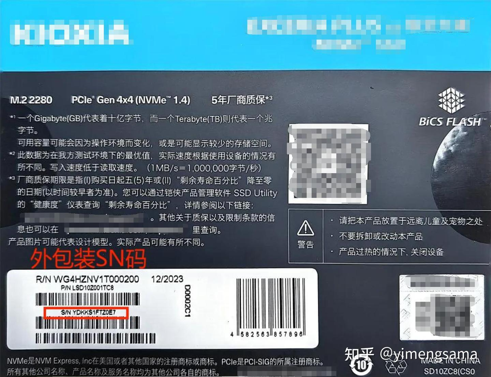

## 1. 主要检查点

1. 检查**外包装**是否有明显的破损；
2. 检查包装盒上的**硬件信息**是否和购买的配置一样；
3. 检查固态硬盘的**金手指**以及硬盘尾部**螺丝固定位**是否有磨损现象；
4. 检查硬盘标签上的 **SN码（序列号）**是否和包装盒信息一致；

## 2. 注意事项

1. 不要随意撕开**硬盘上的标签贴纸**，可能会影响硬盘保修；
2. 接触硬盘前建议先触碰金属表面或者带静电手套等方式减少静电产生；

## CrystalDiskInfo测试

### 2.2. 参数说明

1. **序列号：硬盘的唯一标识，**可用于识别和管理硬盘**；**

2. **接口：**主要分为以下两种（有括号看括号内容）：

- NVM express：**NVME** 协议，对应 **M.2接口**；
- Serial ATA：**SATA** 协议，对应 **SATA接口**；

3. **传输模式：**传输模式左边的参数是**目前**硬盘**使用的通道**，右边是该硬盘**支持的传输模式**；

4. **驱动器号：**驱动器上的字母标识符，又称“盘符”（比如我们平时说的 C盘、D盘 就是指 驱动器号）；

5. **健康状态：一般新盘都是 100%；**

6. **主机总计读入/写入：**新盘这**两项应该都是 0；**

7. **通电次数：**新硬盘通电次数 **小于等于 3；**

8. **通电时间：**新硬盘通电时间为 **0（或者 1 ）；**

  

详细参数参考：[CrystalDiskInfo中各参数介绍](https://link.zhihu.com/?target=https%3A//www.yuque.com/yimengsama/hkcyl0/xl8e5s7gqd0gzi15)