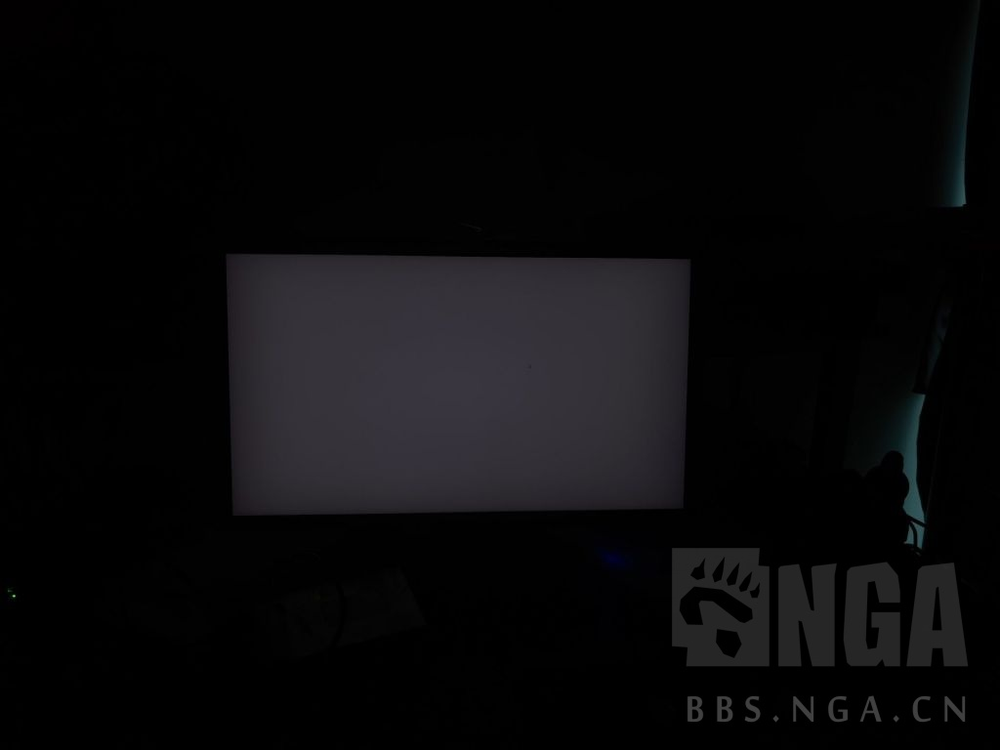
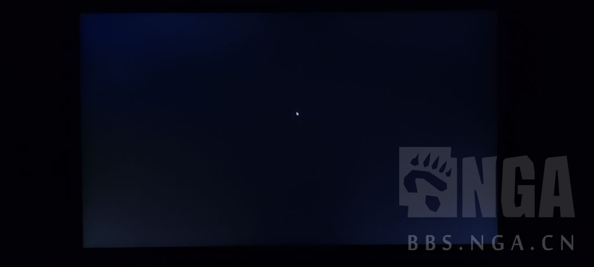
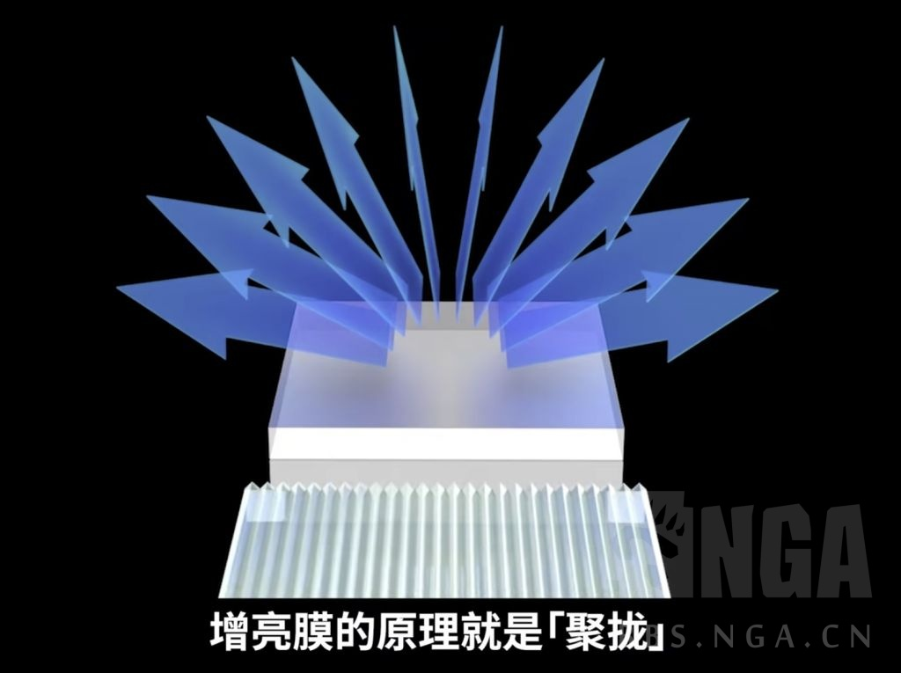
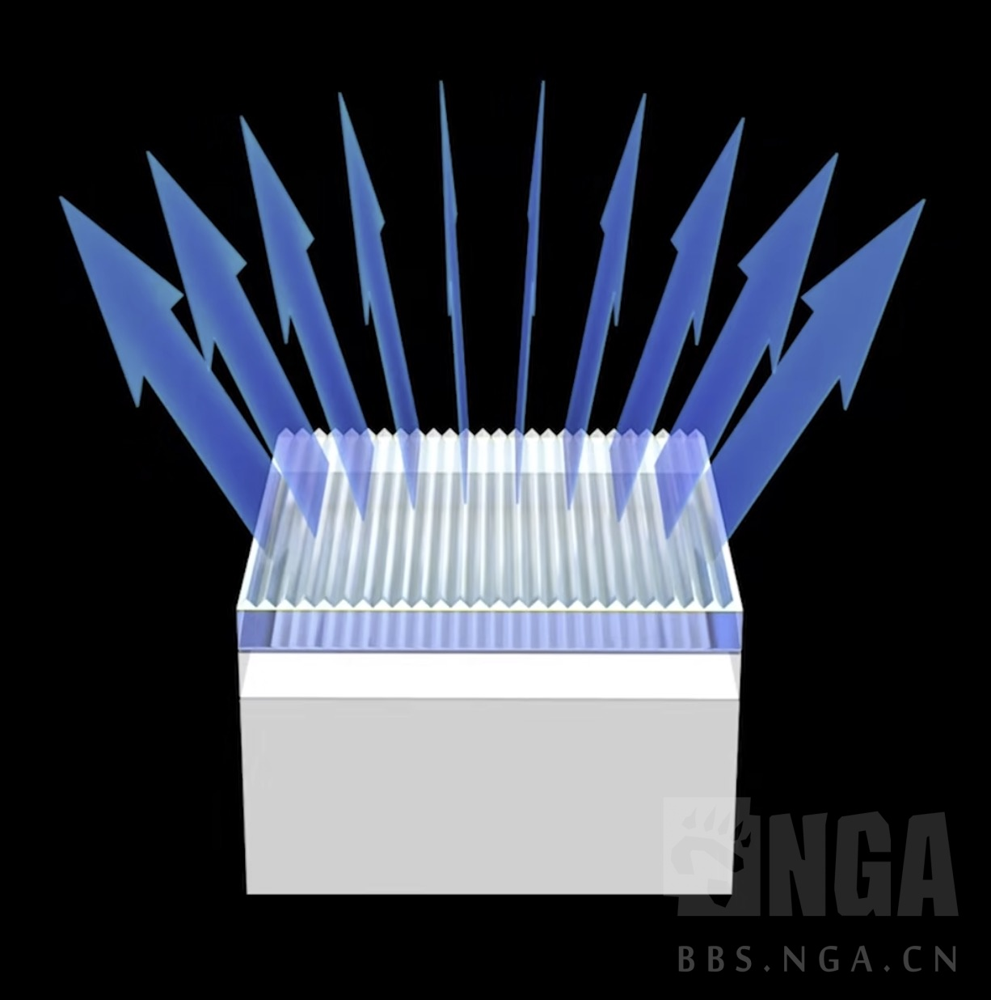
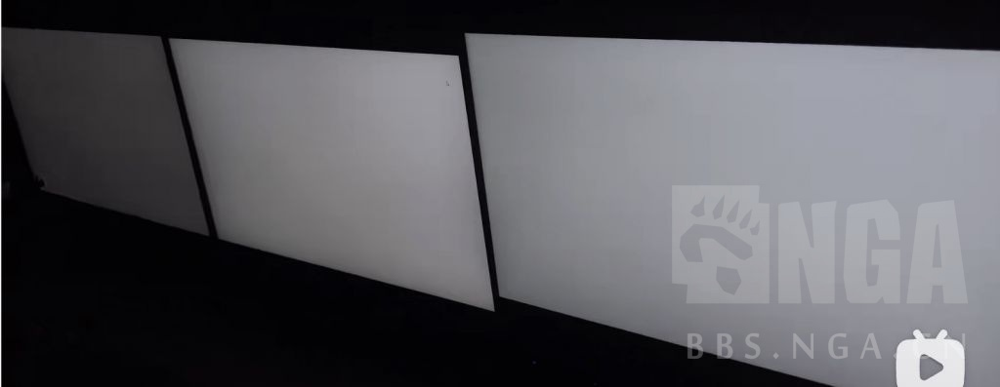
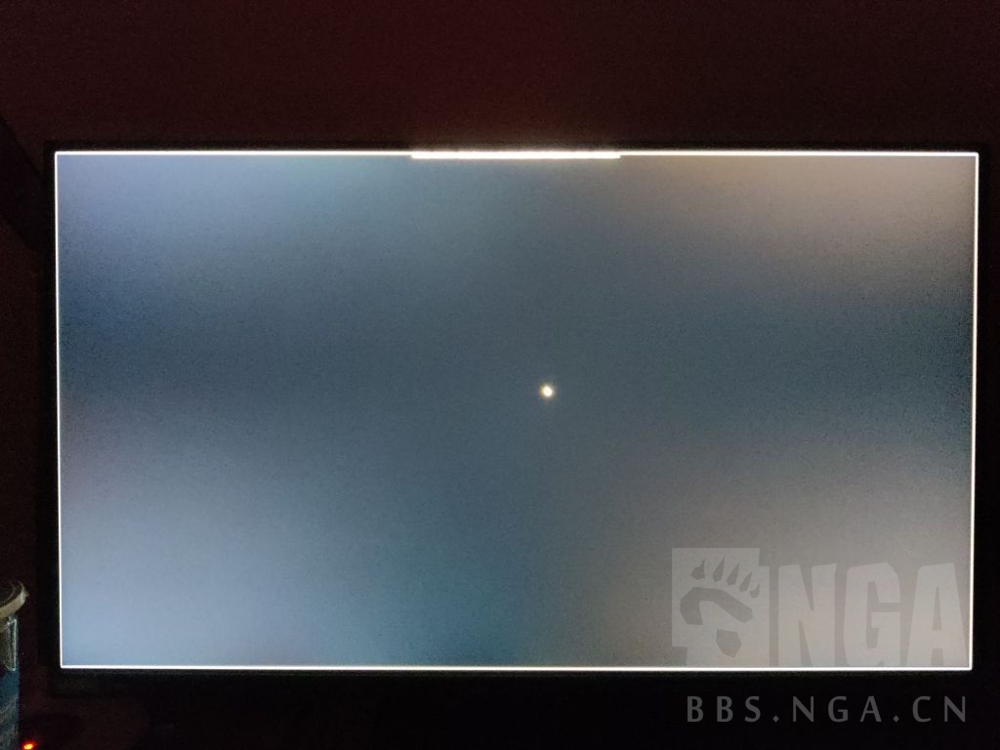
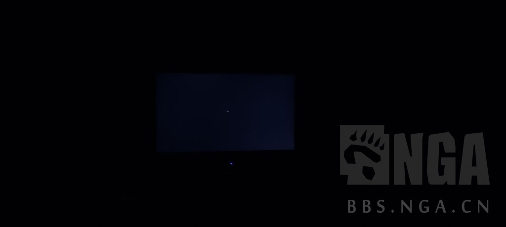
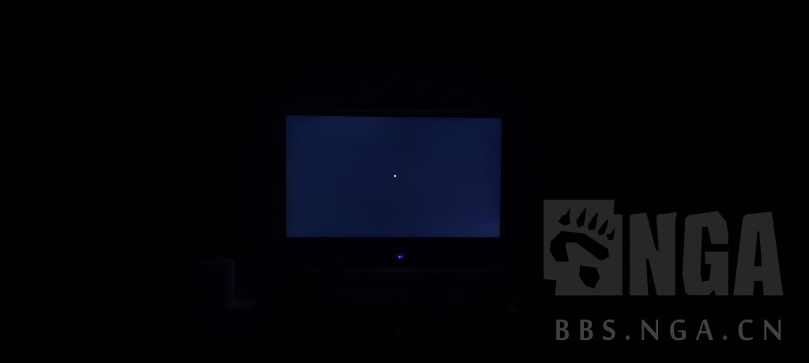

一、坏点  
其实坏点这玩意没啥可以说的，大家大多数在京东购买不满意都可以退换，加入这个说明其实是最近在跟人讨论所谓335国标的时候并没有找到相关的文件  
而且，和大家观点中的1像素点=1坏点不同，国标的坏点实际是根据坏点的尺寸来计算，并且连续的坏点算一个(有数量限制)，实际上国标远比所谓的335标准低得多(毕竟国标其实是质量的底线)  
然后每个品牌对于坏点的标准不太一样，建议大家买显示器的时候问清楚每个品牌的坏点标准，再做购买决定，因为一旦售后政策收紧，有些倾向于完美屏的朋友就会很难受  
这里附上戴尔的坏点标准[戴尔坏点售后政策](https://www.dell.com/support/kbdoc/zh-cn/000126004/dell-display-pixel-guidelines)  
  
二、漏光  
今天看论坛的时候看见很多朋友问关于漏光的问题，实际上这个确实是一个不好说的问题，因为大家拍摄实际上都是用手机，每家的调教都不一样，是没有办法做到肉眼观感的  
所以只能用看均匀度的方式来证明，先上一个大佬的ipspro的均匀度

从这张图可以看到拍摄显示器给大家看漏光首先需对焦，并且保证不能过曝，依据这个需求我拍摄了一张我的自用显示器

可以看到，这张图四角有明显的亮角，但是在我正对着这个亮角的时候，他们就不亮了(其实这里就能看出来左上和右下漏光了，但是毕竟出这个文章是为了方便大家问别人显示器漏光问题，后面的内容是为了排除不漏光但是拍摄看起来漏光的因素)  
在我咨询了大佬之后，得知是bef增量膜的原因，这里用先看评测的视频截图说一下原因

因为现在显示器大多追求高亮度，所以大量采用增量膜，增量膜的作用是把四周的光聚拢让正对着这个方向亮度提升，从而导致其他角度的视角受到影响  
这里给大家看看用了劣质bef的某热门品牌24寸显示器(最左边)

使用了增量膜的显示器如果在很近的地方看或者说是拍照就会出现四个角灰蒙蒙的或者说四个角看起来偏亮导致的  
实际上是bef导致侧视暗场暗不下去的原因(nanoips也是因为类似的原因导致暗场表现差)  
如果再没对焦没调曝光就大概是这样：

这个时候我们只需要距离显示器保证有一定的距离进行拍摄

这样虽然对比明显但是实际上是很难看到漏光的，这个时候我们手动让他过曝一点

就可以看到我这个显示器是左上靠右一点的位置和右下角有轻微的漏光现象  
  
三、响应速度、拖影、刷新率  
先说刷新率，这个其实大家最近应该都知道，联想y25-30选择超频280hz之后实际刷新率会降低到196hz，包括硬件茶谈最近的那个视频2k60转2k144都用到了ufotest的这个测试：  
[刷新率测试](https://www.testufo.com/frameskipping)  
响应速度、拖影、鬼影则需要使用这个[拖影检测](https://www.testufo.com/ghosting)  
在这个检测页面，调节显示器od档位，选择肉眼看起来鬼影、拖影最小的档位即可

> 参考链接：
> 
>https://ngabbs.com/read.php?tid=32420473